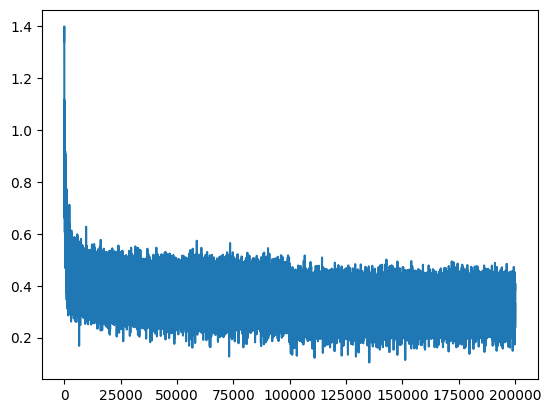
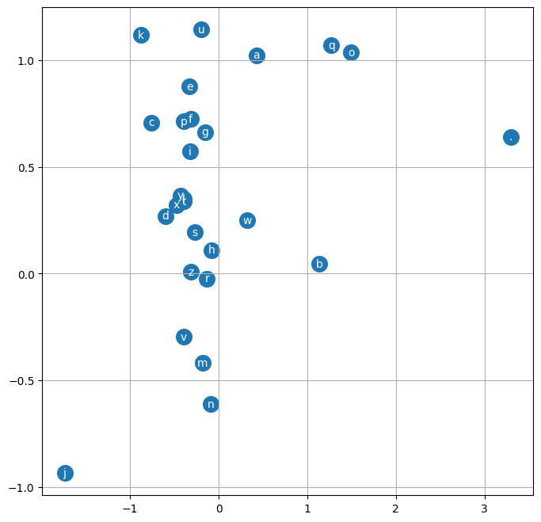

# makemore_mlp.ipynb

## Overview
This Jupyter notebook implements a simple character-level Multi-Layer Perceptron (MLP) language model to generate new names, inspired by Andrej Karpathy's "makemore" project. The model is trained on a dataset of names and learns to generate new, plausible names character by character.

## Main Steps
1. **Data Loading**: Reads a list of names from `names.txt`.
2. **Vocabulary Building**: Creates mappings from characters to indices and vice versa, including a special end-of-word token.
3. **Dataset Preparation**: Converts names into input-output pairs for training, using a fixed context window (block size).
4. **Model Definition**: Implements an MLP with an embedding layer, a hidden layer, and an output layer.
5. **Training**: Trains the model using cross-entropy loss and manual gradient descent.
6. **Sampling**: After training, generates new names by sampling from the model.
7. **Visualization**: Includes code to visualize the learned character embeddings.

## Key Features
- Uses PyTorch for tensor operations and model training.
- Manual implementation of forward and backward passes (no high-level PyTorch modules).
- Simple, interpretable architecture suitable for educational purposes.
- Visualizes training loss and learned embeddings.

## Training Progress Visualization
Below is the steps vs loss graph generated during training:

*Figure: Training steps (x-axis) vs log-loss (y-axis) for the MLP model.*

## Embedding Matrix Visualization
The following plot shows the learned character embeddings (dimensions 0 and 1 of the embedding matrix `C`):

*Figure: 2D visualization of character embeddings learned by the MLP model. Each point represents a character in the vocabulary.*

## Logic and Concepts

### Character Embeddings
Each character in the vocabulary is mapped to a learnable vector (embedding). This allows the model to represent discrete characters as continuous vectors, capturing similarities and relationships between characters.

### Context Window (Block Size)
The model uses a fixed-length context window (block size) to predict the next character. For each training example, the previous `block_size` characters are used as input to predict the next character in the sequence. This enables the model to learn dependencies between characters within a local context.

### Model Architecture
The core model is a Multi-Layer Perceptron (MLP) consisting of:
- **Embedding Layer**: Looks up embeddings for each character in the context window and flattens them into a single vector.
- **Hidden Layer**: Applies a linear transformation followed by a non-linear activation (tanh) to capture complex patterns in the data.
- **Output Layer**: Produces logits for each possible next character, which are converted to probabilities using softmax.

### Training Process
The model is trained using cross-entropy loss, comparing the predicted probabilities to the true next character. Gradients are computed manually and parameters are updated using simple gradient descent. The training loop includes minibatch sampling for efficiency.

### Sampling (Name Generation)
After training, the model can generate new names by sampling one character at a time. Starting with an initial context of all zeros (representing the start of a name), the model predicts the next character, updates the context, and repeats until the end-of-word token is produced.

### Visualization
The notebook includes visualizations of the training loss (to monitor learning progress) and the learned character embeddings (to explore how the model organizes character relationships).

## References
- [Andrej Karpathy's makemore series](https://github.com/karpathy/makemore)
- [PyTorch Documentation](https://pytorch.org/docs/stable/index.html)

---
This notebook is for educational purposes and demonstrates the basics of building and training a neural network for character-level language modeling.
