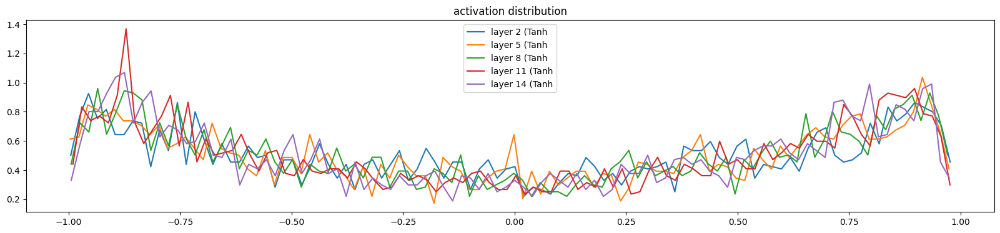
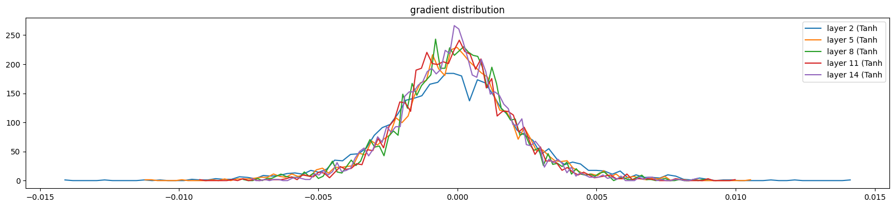
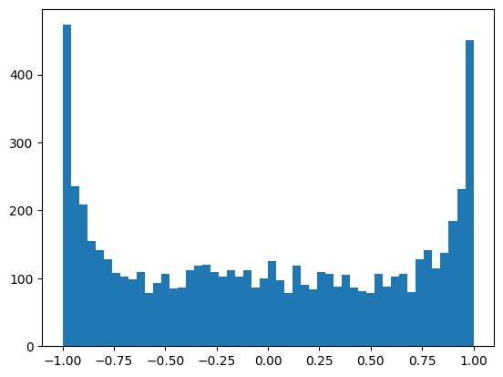
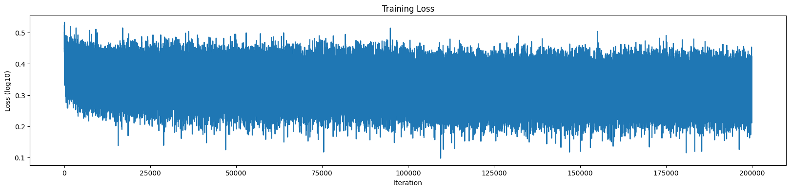
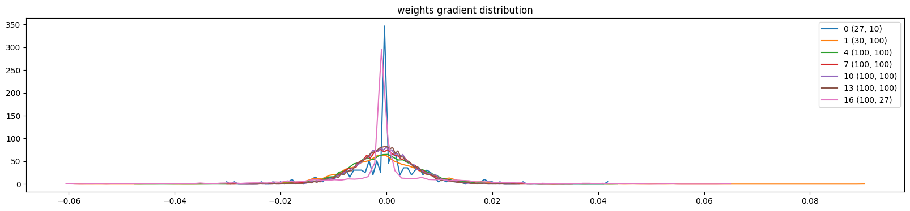

# makemore_mlp2.ipynb

## Overview
This Jupyter notebook extends the makemore MLP project by implementing a deeper character-level neural network for name generation, including custom layers and batch normalization. The notebook is inspired by Andrej Karpathy's makemore series and demonstrates advanced neural network concepts in PyTorch, including manual layer construction, batch normalization, and training visualization.

## Main Steps
1. **Data Loading**: Reads a list of names from `names.txt`.
2. **Vocabulary Building**: Creates mappings from characters to indices and vice versa, including a special end-of-word token.
3. **Dataset Preparation**: Converts names into input-output pairs for training, using a fixed context window (block size).
4. **Model Definition**: Implements a deep MLP with custom Linear, BatchNorm1d, and Tanh layers, assembled into a sequential list.
5. **Training**: Trains the model using cross-entropy loss and manual gradient descent, with learning rate scheduling and batch normalization.
6. **Visualization**: Plots training loss, activation distributions, gradient distributions, and the tanh activation function and its derivative.
7. **Sampling**: Generates new names by sampling from the trained model, character by character.

## Key Concepts and Logic
- **Custom Layers**: The notebook defines its own Linear, BatchNorm1d, and Tanh classes to illustrate how neural network layers work internally.
- **Batch Normalization**: BatchNorm1d is implemented from scratch to stabilize and accelerate training.
- **Deep MLP**: The model consists of multiple hidden layers, each followed by batch normalization and tanh activation, allowing the network to learn more complex patterns.
- **Manual Training Loop**: Training is performed with explicit forward and backward passes, parameter updates, and learning rate scheduling.
- **Visualization**: The notebook visualizes training loss, activation and gradient distributions, and the tanh function and its derivative to provide insight into the training process and network behavior.

## How to Use
1. Ensure you have `names.txt` in the same directory as the notebook.
2. Install required packages: `torch`, `matplotlib`, and `numpy`.
3. Run all cells in order to train the model and generate new names.

## Training and Analysis Plots
The following plots, found in `assets/mlp2_output/`, illustrate key aspects of the training and analysis of the deep MLP model:

### 1. Activation Distribution

*Shows the distribution of activations in the hidden layers, helping to diagnose saturation and information flow.*

### 2. Gradient Distribution

*Displays the distribution of gradients in the network, useful for identifying vanishing or exploding gradients.*

### 3. Hidden Layer Histogram

*Visualizes the histogram of hidden layer activations, providing insight into the range and spread of neuron outputs.*

### 4. Training Loss Curve

*Plots the training loss over iterations, showing the learning progress and convergence.*

### 5. Weights Gradient Distribution

*Shows the distribution of weight gradients, helping to monitor the effectiveness of learning and parameter updates.*

## File Structure
- `makemore_mlp2.ipynb`: This notebook (deep MLP model with custom layers)
- `names.txt`: List of names for training

## Comparison: Original MLP vs. MLP with BatchNorm and Improved Initialization

| Model Version | Batch Normalization | Weight Initialization | Depth | Training Stability | Generalization |
|---------------|--------------------|----------------------|-------|-------------------|---------------|
| Original MLP  | No                 | Standard (random)    | Shallow (1-2 layers) | Lower, can suffer from vanishing/exploding gradients | Moderate |
| MLP + BatchNorm | Yes              | Standard (random)    | Deep (many layers)   | Improved, more robust to learning rate and depth | Better |
| MLP + BatchNorm + Better Init | Yes | Scaled (e.g., He/Xavier, custom scaling) | Deep (many layers) | Best, enables very deep networks to train efficiently | Best |

**Key Differences:**
- **Batch Normalization**: Normalizes activations within each layer, reducing internal covariate shift, allowing for higher learning rates, and improving convergence speed and stability.
- **Weight Initialization**: Using scaled initialization (e.g., dividing by sqrt(fan-in), or using He/Xavier methods) helps maintain the variance of activations and gradients throughout the network, preventing vanishing/exploding gradients.
- **Depth**: With batch normalization and better initialization, much deeper networks can be trained effectively, capturing more complex patterns in the data.
- **Training Stability**: The combination of batch normalization and good initialization makes training more stable and less sensitive to hyperparameters.
- **Generalization**: These improvements often lead to better generalization and lower validation/test loss.

This notebook demonstrates these improvements by building a deep MLP with custom batch normalization and careful weight initialization, resulting in more stable and effective training compared to the original shallow MLP.

## References
- [Andrej Karpathy's makemore series](https://github.com/karpathy/makemore)
- [PyTorch Documentation](https://pytorch.org/docs/stable/index.html)

---
This notebook is for educational purposes and demonstrates advanced neural network concepts, including custom layer implementation and batch normalization, for character-level language modeling.
